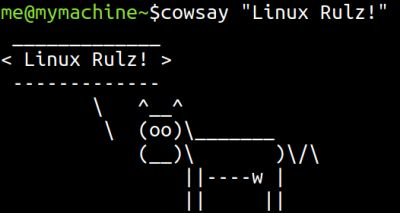

# Répertoire de commandes Linux

Sebastien Kramm - IUT RT Rouen

Dépot public

* Travaillant plutot sous Debian et dérivés, la liste ici présuppose un shell Bash.
Pour d'autres shell ou distribution, il est possible que quelques commandes diffèrent.

* Un tel répertoire est par nature arbitraire, aucune prétention d'exhaustivité.

* Pour l'instant, une commande ne peut être référencée que dans une seule catégorie.
Pour certaines commandes, un choix arbitraire a du être fait entre deux catégories possibles.

* Les 2 pages ci-dessous sont générées automatiquement via une intégration continue, à partir de fichier source
(voir dossier [content/]().

* La première colonne contient un **lien** Google sur la commande en question.
Pensez à faire un clic-droit->"ouvrir dans un nouvel onglet" pour ne pas perdre la page d'origine.

* La dernière colonne indique s'il s'agit d'un _builtin_ (commande native du shell) ou d'un programme externe qui peut être existant ou pas sur la VM Github: _installed_ ou NI (_Not Installed_).
Dans ces derniers cas, cela signifie qu'il faille peut-être l'installer sur votre machine avant de pouvoir l'utiliser.

[liste alphabétique](linux_cmds_list_alpha.md) - 
[par catégorie](linux_cmds_list_cat.md)

(voir [aussi ici](https://www.google.com/search?q=linux+cheat+sheet))
