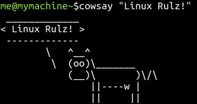

# Répertoire de commandes Linux

Sebastien Kramm - IUT RT Rouen

[liste alphabétique](linux_cmds_list_alpha.md) - 
[par catégorie](linux_cmds_list_cat.md)

(voir [aussi ici](https://www.google.com/search?q=linux+cheat+sheet))

## Remarques

* Travaillant plutot sous Debian et dérivés, la liste ici présuppose un shell Bash.
Pour d'autres shell ou distribution, il est possible que quelques commandes diffèrent.

* Un tel répertoire est par nature arbitraire, aucune prétention d'exhaustivité.
Sont notamment omis un certains nombre d'outils orientés "dev/système", par exemple la suite ["GNU Binutils"](https://www.gnu.org/software/binutils/),
ou des commandes "_builtin_" peu utilisées.

* Certaines commandes apparaissent dans plusieurs catégories, ce qui explique que le nombre de commande diffère entre la liste alphabétique et la liste par catégorie.

* Les pages ci-dessus sont générées automatiquement via une intégration continue, à partir de 2 fichiers CSV
(voir dossier [content/](content/)).

* La première colonne contient un lien vers la page de "man" (ou "help" pour les "_builtin_") correspondante, générée via la CI, et construite directement sur la VM de Github
(et sous réserve que la commande soit pas présente sur cette machine, évidemment).

* La dernière colonne indique s'il s'agit d'un _builtin_ (commande native du shell) ou d'un programme externe, qui peut alors être existant ou pas sur la VM Github:
_installed_ ou NI (_Not Installed_).
Dans ces derniers cas, cela signifie qu'il faille peut-être l'installer sur votre machine avant de pouvoir l'utiliser.

* Historiquement, ceci a été fait dans un contexte "enseignement", d'où le choix du français.
Même si m'apparait aujourd'hui comme un peu curieux!

